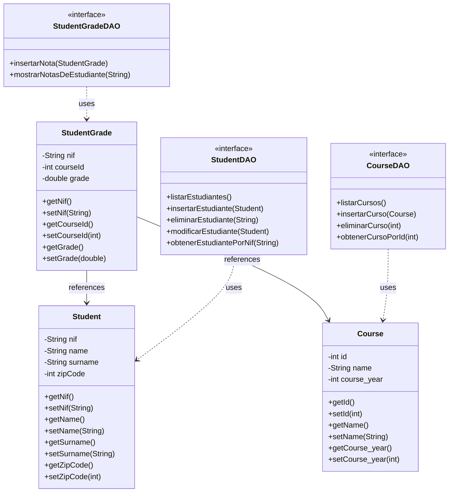
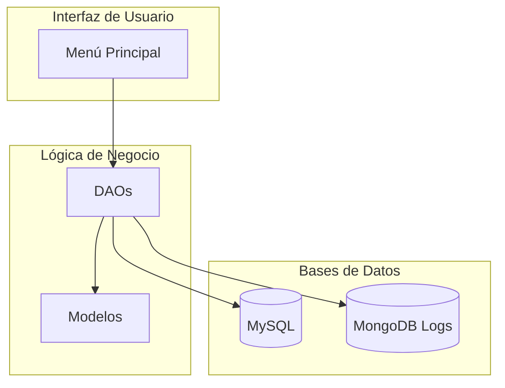
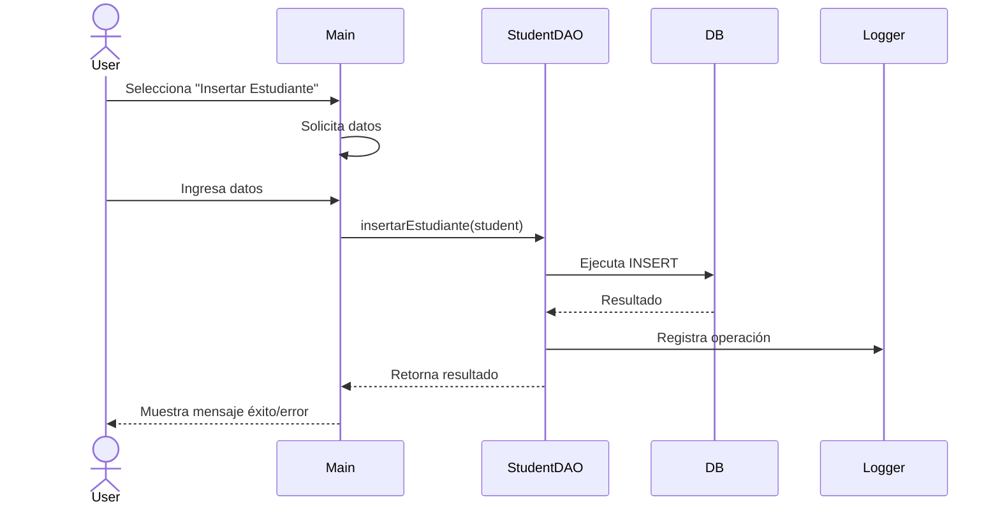

# Diagramas UML

## Diagrama de Clases

```mermaid
classDiagram
    class Student {
        -String nif
        -String name
        -String surname
        -int zipCode
        +getNif()
        +setNif(String)
        +getName()
        +setName(String)
        +getSurname()
        +setSurname(String)
        +getZipCode()
        +setZipCode(int)
    }
    
    class Course {
        -int id
        -String name
        -int course_year
        +getId()
        +setId(int)
        +getName()
        +setName(String)
        +getCourse_year()
        +setCourse_year(int)
    }
    
    class StudentGrade {
        -String nif
        -int courseId
        -double grade
        +getNif()
        +setNif(String)
        +getCourseId()
        +setCourseId(int)
        +getGrade()
        +setGrade(double)
    }

    class StudentDAO {
        <<interface>>
        +listarEstudiantes()
        +insertarEstudiante(Student)
        +eliminarEstudiante(String)
        +modificarEstudiante(Student)
        +obtenerEstudiantePorNif(String)
    }

    class CourseDAO {
        <<interface>>
        +listarCursos()
        +insertarCurso(Course)
        +eliminarCurso(int)
        +obtenerCursoPorId(int)
    }

    class StudentGradeDAO {
        <<interface>>
        +insertarNota(StudentGrade)
        +mostrarNotasDeEstudiante(String)
    }

    StudentGrade --> Student : references
    StudentGrade --> Course : references
    StudentDAO ..> Student : uses
    CourseDAO ..> Course : uses
    StudentGradeDAO ..> StudentGrade : uses
```

## Diagrama de Componentes

```mermaid
graph TB
    subgraph UI[Interfaz de Usuario]
        Menu[Menú Principal]
    end
    
    subgraph BL[Lógica de Negocio]
        DAO[DAOs]
        Models[Modelos]
    end
    
    subgraph DB[Bases de Datos]
        MySQL[(MySQL)]
        MongoDB[(MongoDB Logs)]
    end
    
    Menu --> DAO
    DAO --> Models
    DAO --> MySQL
    DAO --> MongoDB
```

## Diagrama de Secuencia: Insertar Estudiante

```mermaid
sequenceDiagram
    actor User
    participant Main
    participant StudentDAO
    participant DB
    participant Logger
    
    User->>Main: Selecciona "Insertar Estudiante"
    Main->>Main: Solicita datos
    User->>Main: Ingresa datos
    Main->>StudentDAO: insertarEstudiante(student)
    StudentDAO->>DB: Ejecuta INSERT
    DB-->>StudentDAO: Resultado
    StudentDAO->>Logger: Registra operación
    StudentDAO-->>Main: Retorna resultado
    Main-->>User: Muestra mensaje éxito/error
```
